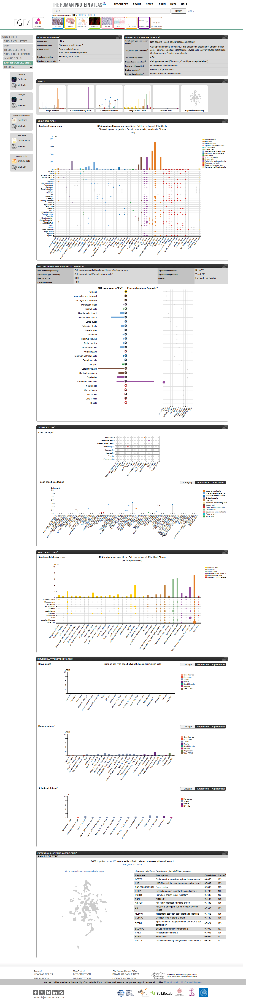
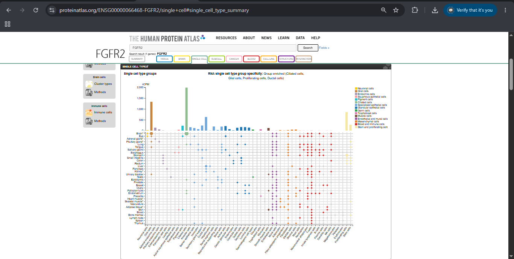
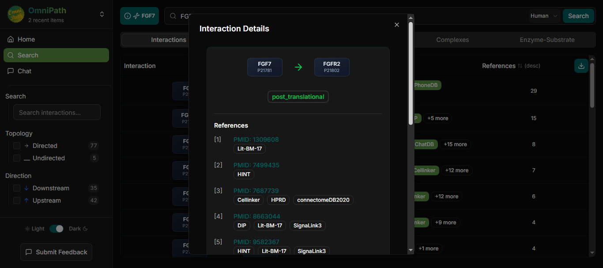
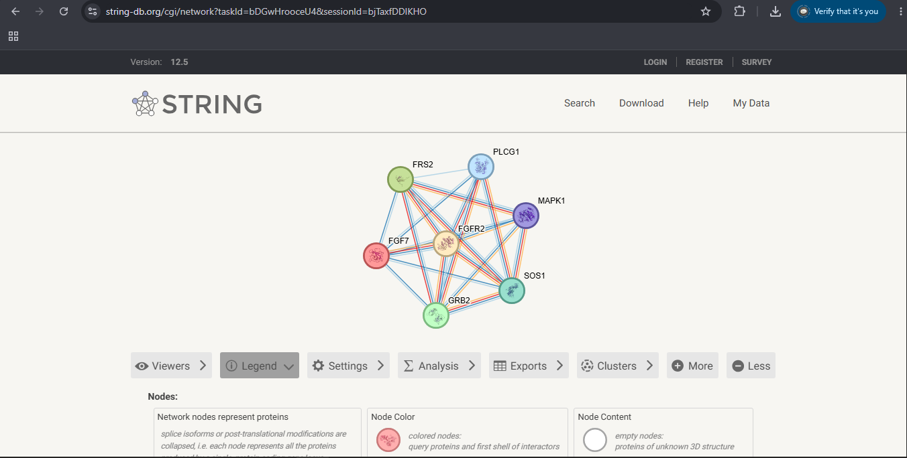
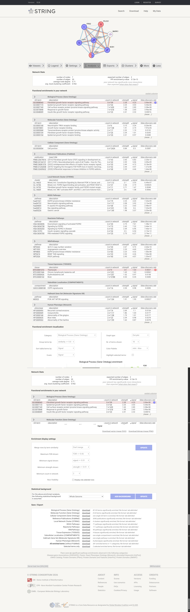
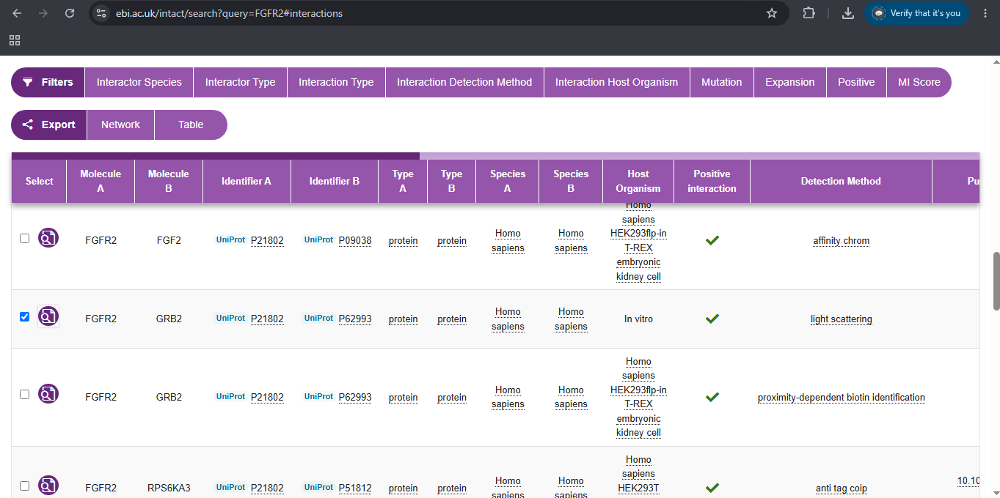
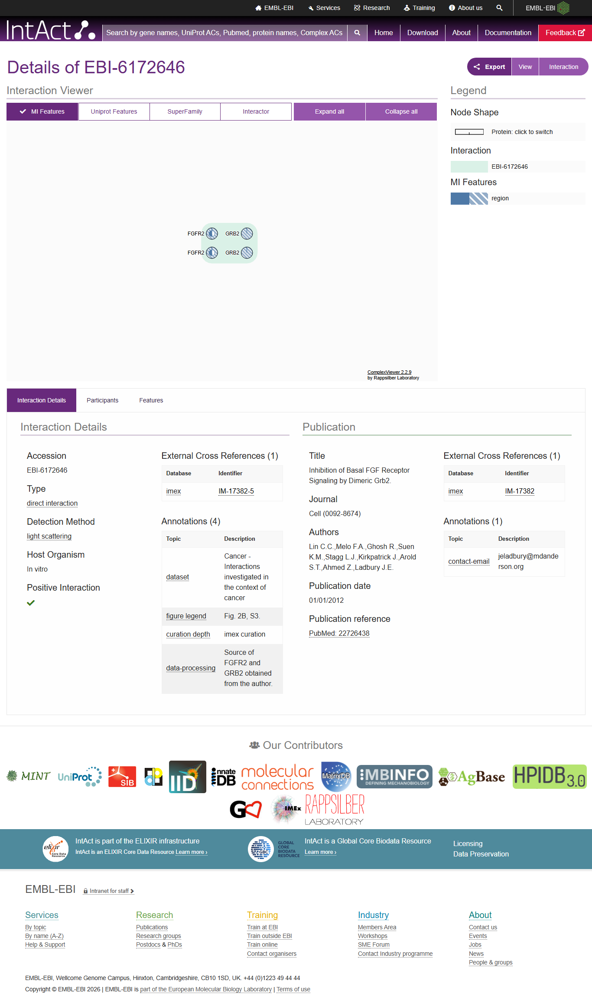
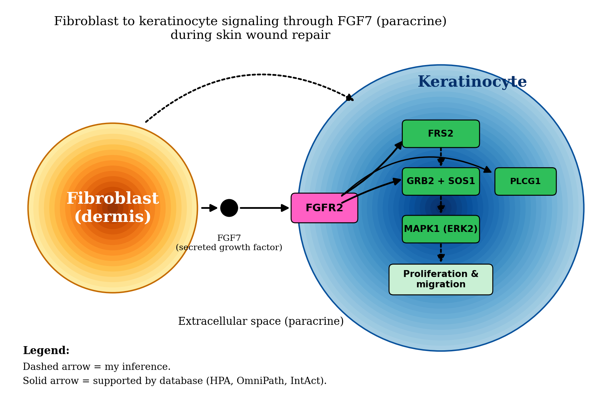

# Cell-to-Cell Communication: Fibroblast to Keratinocyte through FGF7

Isabella Tuble | Cell and Molecular Biology, Section A

## Biological question

Can a fibroblast send an FGF7 signal to a keratinocyte, and what do the databases say about how that signal works?

## Sender cell and context

Sender cell: fibroblast (dermis)

Context: skin wound repair (re-epithelialization).

## Candidate ligand and sender-cell evidence
| Item | Finding |
|---|---|
| Ligand | FGF7 (Fibroblast growth factor 7, P21781), a secreted growth factor |
| HPA single cell data | RNA is "cell type enhanced" with fibroblasts listed first |
| HPA protein class | Secreted; extracellular location predicted to be secreted |
| HPA immune cell data | Not detected in immune cells |
| Signaling type | Paracrine |
| Caveat | FGF7 is also enhanced in fibro-adipogenic progenitors, smooth muscle cells and mural cells. Protein-level data (DVP) were strongest in smooth muscle cells, and HPA reports "Agreement detection: No". The RNA single cell data are my stronger evidence for fibroblasts. |

## Receptor and receiver cell
| Item | Finding |
|---|---|
| Receptor | FGFR2 (P21802) |
| Receiver cell | Keratinocyte (epithelial cell) |
| HPA evidence | FGFR2 RNA is "group enriched" in ciliated cells, glial cells, proliferating cells and ductal cells. Squamous epithelial cells are not among the enriched groups. |
| Other evidence | The STRING/UniProt description of FGF7 says it is active on keratinocytes. FGF7 signals mainly through the epithelial FGFR2-IIIb isoform, which HPA RNA data cannot resolve. FILL IN: one peer-reviewed reference on FGF7/KGF and FGFR2b in keratinocytes. |
| Caveat | HPA does not support keratinocytes as the receiver by itself. This choice is partly my own reasoning. |

Checkpoint sentence: The fibroblast produces FGF7, which can signal through FGFR2 on keratinocytes in the context of skin wound repair.

FGF7 (KGF) is made by mesenchymal cells and acts through the epithelial FGFR2-IIIb isoform on keratinocytes, mainly in a paracrine way (Yen et al., 2014).

## OmniPath findings

- Interactions: directed FGF7 -> FGFR2 interaction with 29 references from many resources (including CellCall, CellChatDB, CellPhoneDB, Cellinker, connectomeDB2020, HPRD and SignaLink3). Example PMIDs: 1309608, 7499435, 7687739.

- The interaction type label is `post_translational`. This is OmniPath's category label and does not mean FGF7 modifies FGFR2.

- Downstream: FGFR2 -> FRS2 (14 references), FGFR2 -> GRB2 (12) and FGFR2 -> PLCG1 (17).

- Disagreement: the FGFR2 -> FRS2 edge is drawn with an inhibition sign in OmniPath. The literature describes FRS2 as an FGFR substrate and adaptor, so I treated the sign as an annotation to check and not as a finding.

- Limit: OmniPath is general and not specific to fibroblasts or keratinocytes. The cell-type evidence comes from HPA.

## STRING network interpretation

- Input: FGF7, FGFR2, FRS2, GRB2, SOS1, PLCG1, MAPK1 (Homo sapiens)

- Network: 7 nodes, 20 edges, expected edges 2, PPI enrichment p = 5.12e-13

| Source | Enriched term | Proteins in network | FDR |
|---|---|---|---|
| GO Biological Process | Fibroblast growth factor receptor signaling pathway (GO:0008543) | 5 of 59 | 3.96e-08 |
| Reactome | Downstream signaling of activated FGFR2 (HSA-5654696) | 6 of 30 | 1.38e-13 |
| KEGG | Ras signaling pathway (hsa04014) | 5 of 231 | 7.23e-09 |

Proteins that connect the receptor to the response:

- FRS2: adaptor that docks onto the activated FGF receptor

- GRB2 and SOS1: link the receptor to Ras activation

- MAPK1: kinase that carries the signal toward proliferation and migration

Caution: I picked these seven proteins because I already knew they belong to FGFR signaling, so the strong enrichment is partly built in. It supports the pathway but does not discover it. A STRING edge means a functional association, not proof of direct binding or direction. PLCG1 is an alternative branch, and I did not use it as a main step.

## IntAct validation

Pair examined: FGFR2 (P21802) and GRB2 (P62993), Homo sapiens. IntAct showed 566 records for my FGFR2 search. I read the FGFR2-GRB2 rows on the first page.

| Method | Source | Interaction type | Host |
|---|---|---|---|
| Light scattering | Lin et al. (2012), PMID 22726438 | direct interaction | in vitro |

- Record: EBI-6172646. It shows two FGFR2 and two GRB2 molecules, so it describes a dimeric GRB2 bound to FGFR2.

- The dataset annotation says "Cancer - interactions investigated in the context of cancer", and the source proteins were obtained from the authors.

- Other FGFR2-GRB2 records on the page used ITC, NMR, FRET (HEK293T cells), protein kinase assay and proximity-dependent biotin
identification. I did not use these as my main evidence.

- Conclusion: the evidence supports a direct physical interaction between FGFR2 and GRB2. The main record is in vitro with purified components, not fibroblasts or keratinocytes.

## Final model

Solid arrows are supported by the databases. Dashed arrows are my inference.

### Interpretation

I chose the fibroblast as my sender cell and followed FGF7 from there. In the Human Protein Atlas, FGF7 RNA is cell type enhanced in fibroblasts and the protein is annotated as secreted, so I treated this as paracrine signaling. FGF7 is also enhanced in smooth muscle and mural cells, and the protein-level data did not fully agree with RNA.

OmniPath lists a directed FGF7 to FGFR2 interaction backed by 29 references. HPA does not list squamous epithelial cells among the cell groups enriched for FGFR2, so my choice of keratinocytes rests mainly on database and literature descriptions of FGF7 as active on epithelial cells, and it is partly my own reasoning.

For STRING I entered FGF7, FGFR2, FRS2, GRB2, SOS1, PLCG1 and MAPK1. The network had 20 edges where 2 were expected, and the top terms were FGFR signaling (FDR 3.96e-08) and downstream signaling of activated FGFR2 (FDR 1.38e-13). I picked these proteins myself, so this supports the pathway but does not discover it. In IntAct, FGFR2 and GRB2 have a light scattering record labeled direct interaction, but it is in vitro only.

The well supported parts are FGF7 binding FGFR2 and the FGFR2-GRB2 link. The inferred parts are that fibroblasts signal to keratinocytes in the body, the order FRS2, GRB2, SOS1 and MAPK1, and that the result is proliferation and migration.

## Answers to the lab questions
1. **Sender cell:** Fibroblast, a dermal connective tissue cell that acts in skin wound repair.

2. **Signaling molecule:** FGF7. HPA shows cell type enhanced RNA in fibroblasts and a secreted protein class.

3. **Receptor and receiver:** FGFR2 on keratinocytes.

4. **Type of signaling:** Paracrine. FGF7 is secreted and acts on nearby cells.

5. **Relevant STRING proteins:** FRS2 (adaptor), GRB2 and SOS1 (link the receptor to Ras), MAPK1 (carries the signal toward the response).

6. **Enriched process:** FGFR signaling pathway (GO, FDR 3.96e-08), Reactome downstream signaling of activated FGFR2 (FDR 1.38e-13), and KEGG Ras signaling pathway. All fit my mechanism.

7. **IntAct result:** FGFR2 and GRB2 have a light scattering record (EBI-6172646, PMID 22726438) labeled direct interaction, in vitro.

8. **Strong vs inferred:** Strong: FGF7 binds FGFR2, and FGFR2 and GRB2 interact directly. Inferred: that fibroblasts really signal to keratinocytes in the body, that keratinocytes are the receiver, the order of the downstream proteins, and the final response.

9. **Expected response:** Keratinocyte proliferation and migration (re-epithelialization). FGFR signaling activates the Ras/MAPK cascade, and STRING describes FGF7 as a paracrine effector of epithelial cell proliferation. I did not measure this.

## Limits

- I chose the STRING proteins myself, so that network is not an independent discovery.

- HPA does not show FGFR2 enriched in keratinocytes, so the receiver cell is partly my own reasoning.

- FGF7 is also expressed in smooth muscle and mural cells.

- The IntAct record is in vitro and from a cancer-oriented dataset.

- Databases show that the parts exist and can bind. They do not prove this exact fibroblast to keratinocyte signal happens in the body.

## References

del Toro, N., Shrivastava, A., Ragueneau, E., Meldal, B., Combe, C., Barrera, E., Perfetto, L., How, K., Ratan, P., Shirodkar, G., Lu, O., Mészáros, B., Watkins, X., Pundir, S., Licata, L., Iannuccelli, M., Pellegrini, M., Martin, M. J., Panni, S., . . . Hermjakob, H. (2022). The IntAct database: Efficient access to fine-grained molecular interaction data. *Nucleic Acids Research, 50*(D1), D648–D653. https://doi.org/10.1093/nar/gkab1006

Karlsson, M., Zhang, C., Méar, L., Zhong, W., Digre, A., Katona, B., Sjöstedt, E., Butler, L., Odeberg, J., Dusart, P., Edfors, F., Oksvold, P., von Feilitzen, K., Zwahlen, M., Arif, M., Altay, O., Li, X., Ozcan, M., Mardinoglu, A., . . . Lindskog, C. (2021). A single–cell type transcriptomics map of human tissues. *Science Advances, 7*(31), Article eabh2169. https://doi.org/10.1126/sciadv.abh2169

Lin, C. C., Melo, F. A., Ghosh, R., Suen, K. M., Stagg, L. J., Kirkpatrick, J., Arold, S. T., Ahmed, Z., & Ladbury, J. E. (2012). Inhibition of basal FGF receptor signaling by dimeric Grb2. *Cell*. PubMed PMID: 22726438.

Szklarczyk, D., Kirsch, R., Koutrouli, M., Nastou, K., Mehryary, F., Hachilif, R., Gable, A. L., Fang, T., Doncheva, N. T., Pyysalo, S., Bork, P., Jensen, L. J., & von Mering, C. (2023). The STRING database in 2023: Protein–protein association networks and functional enrichment analyses for any sequenced genome of interest. *Nucleic Acids Research, 51*(D1), D638–D646. https://doi.org/10.1093/nar/gkac1000

Türei, D., Valdeolivas, A., Gul, L., Palacio-Escat, N., Klein, M., Ivanova, O., Ölbei, M., Gábor, A., Theis, F., Módos, D., Korcsmáros, T., & Saez-Rodriguez, J. (2021). Integrated intra- and intercellular signaling knowledge for multicellular omics analysis. *Molecular Systems Biology, 17*(3), Article e9923. https://doi.org/10.15252/msb.20209923

UniProt Consortium. (2023). UniProt: The Universal Protein Knowledgebase in 2023. *Nucleic Acids Research, 51*(D1), D523–D531. https://doi.org/10.1093/nar/gkac1052

Yen, T. T. H., Thao, D. T. P., & Thuoc, T. L. (2014). An overview on keratinocyte growth factor: From the molecular properties to clinical applications. *Protein & Peptide Letters, 21*(3), 306–317. https://doi.org/10.2174/09298665113206660115

## Database links
- Human Protein Atlas: https://www.proteinatlas.org/
- OmniPath: https://omnipathdb.org/
- STRING: https://string-db.org/
- IntAct: https://www.ebi.ac.uk/intact/
- UniProt FGF7 (P21781): https://www.uniprot.org/uniprotkb/P21781
- UniProt FGFR2 (P21802): https://www.uniprot.org/uniprotkb/P21802
- UniProt GRB2 (P62993): https://www.uniprot.org/uniprotkb/P62993
